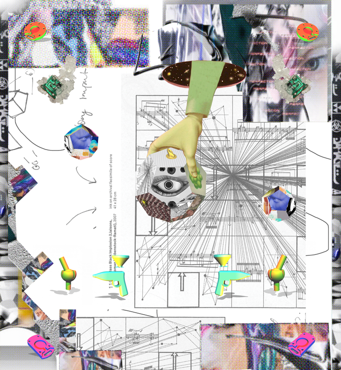
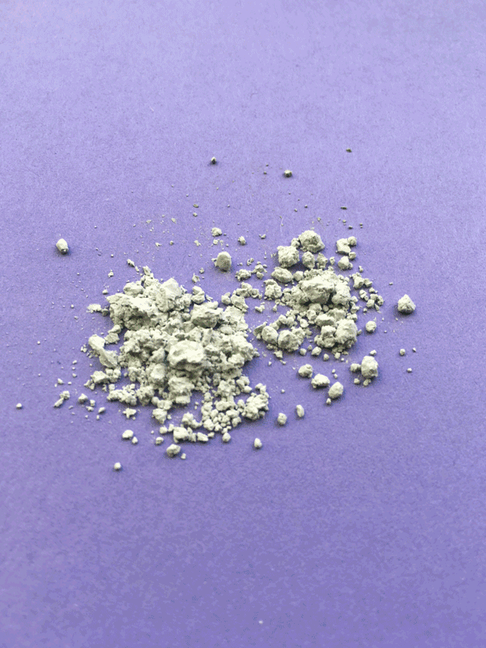

# Minor Makers Lab: Making as Research (30ECTS)

*Exploring Sustainable High and Low Tech Materials through Critical Crafts*

  *Image by Kristin Jakubek*

## Are you curious, creative, and critical? 

Join us for a semester of transdisciplinary making, experiments, hacking, tinkering, digital fabrication, soft robotics, and electronics. This semester course offered at the Amsterdam University of Applied Sciences provides intense training in digital fabrication (tools and techniques like laser cutting, 3D printing, new materials, and electronics) and an introduction to tinkering and making-as-research.

In a world where disposable products dominate, it's time to rethink the value of making and the way we make things. We have a DIY and open-source approach. This international minor challenges you to think critically about the impact of your creations on the environment. We explore alternative and more sustainable ways of making things. We aim to empower you to become a critical maker and tinkerer. In this minor, the act of making and tinkering is a way to research, discover, and push boundaries. 

This semester, the Makers Lab at the Amsterdam University of Applied Sciences is your playground. 

### Week 1-10: course work
The first half of the minor focuses on experiments and tinkering. We’ll explore the wonderful world of DIY critical making and digital fabrication. 

### Week 11-12: project work
This second half of this minor program offers a unique opportunity to apply what you learned while working with a transdisciplinary team on a research project. You’ll rediscover the potential of traditional materials and techniques. You'll learn how to use them in the context of high-tech crafts and sustainable fabrication. 

Join us in the Minor Makers Lab and discover the art of making in the 21st century. Unleash your creativity and make a positive impact on the world!

 *Image by Kristin Jakubek*

 *Image by Kristin Jakubek*

### Learning Objectives
At the end of this minor you have developed yourself as transdisciplinairy tinkerer. You bring valuable hands-on knowledge and maker skills to any professional environment: you can work with conceptual frameworks to initiate question-driven design processes with an awareness of the context. This allows you to develop an ethical contemporary maker practice and share your expertise in a way that allows others to build on and learn from your work.

#### Transdisciplinairy Learning

The student brings in their own expertise, values the expertise of other students and finds synergy with various different disciplines to create and tinker purposeful ideas and concepts.

#### Digital Crafts and Making

The student understands both material and technology and knows how to manipulate, tinker and experiment with it. The student is aware of their responsibility and the impact of making by actively building upon what is already out there and by giving back through sharing their insights with the (maker) community.

## Admission info
This course is offered in semester 2 (February - July)

**Admission requirements**

(the teaching and examination regulations of the Bachelor programme apply)

This minor welcomes students with an open, curious and analytical attitude, coming from a fashion, design, art or engineering background, who have demonstrable experience with 2 or more of the following at intermediate level: 3D modeling, electronics, 2D design (vector drawing), programming skills, garment construction, molding & casting, mechanical engineering/machine building. As the entire program is taught in English, participants are required to speak English well and are able to read and understand English texts.

​
## Teaching staff & coordination
​​[Micky van Zeijl](mailto:m.van.zeijl@hva.nl) | Harm van Vugt| Sam Edens | Ista Boszhard | and guests

 *Image by Kristin Jakubek*

