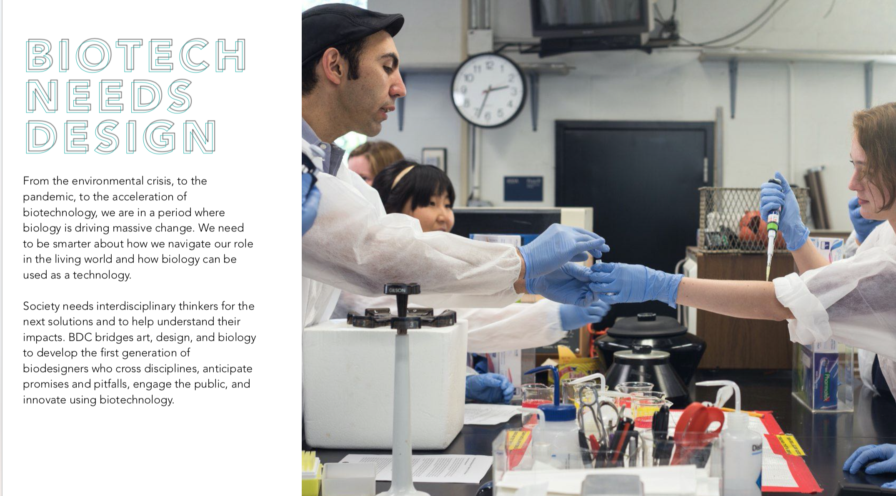

*Image by Kristin Jakubek*

## Minor Makers Lab: Making as Research at AUAS

This semester course taught at the Amsterdam University of Applied Sciences challenges you to think critically about the way you make and design. You acquire hands-on knowledge and skills that enable you to experience how things might be made differently and discover alternatives to reduce the environmental impact of man-made things. 

More about the [Minor Makers Lab course at AUAS](./about.md).

## News: Makers Lab X Biodesign!

This year, we will be partnering up with the [Biodesign Challenge](https://biodesignchallenge.org/) an international competition and education program to support and shape the first generation of biodesigners. Are you up for an adventure and do you want to explore the do's, don'ts and dilemmas of designing with living organisms? Then join us in February 2021!

[More information about the BioDesign Challenge (pdf)](./assets/BioDesignChalenge_schooldeck.pdf)

  *Image credit: Biodesign Challenge*

