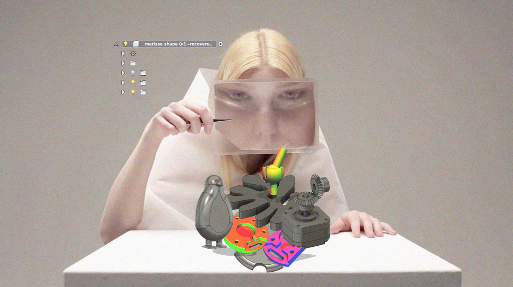

*Image by Kristin Jakubek*

This semester course taught at the Amsterdam University of Applied Sciences challenges you to think critically about the way you make and design. You acquire hands-on knowledge and skills that enable you to experience how things might be made differently and discover alternatives to reduce the environmental impact of man-made things. 

To find out more, go to the [about page](./about.md).