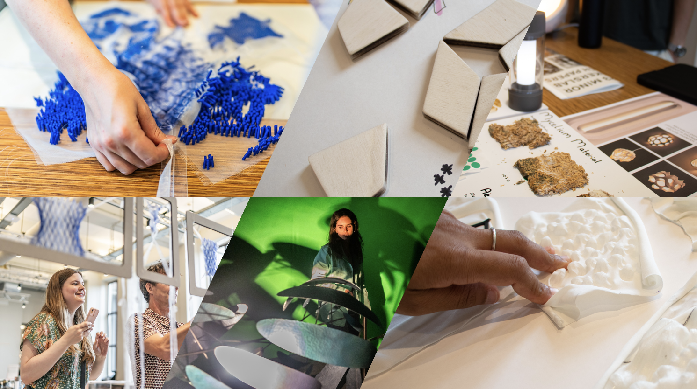

## Minor Makers Lab: Making as Research at AUAS

Are you curious, creative, and critical? 
Join us for a semester of transdisciplinary making, experiments, hacking, tinkering, digital fabrication, soft robotics, and electronics. This semester course offered at the Amsterdam University of Applied Sciences provides intense training in digital fabrication (tools and techniques like laser cutting, 3D printing, new materials, and electronics) and an introduction to tinkering and making-as-research.

More about the [Minor Makers Lab course at AUAS](./about.md).

